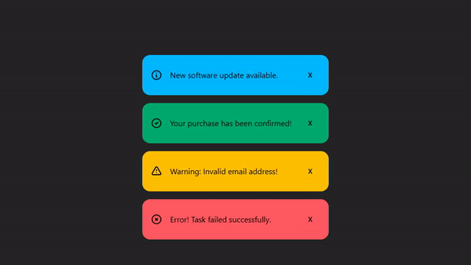

# Alert Component Vue Exercise

## Project Overview
This project was developed as the final exercise in the "Vue Component Fundamentals with the Composition API" course by Daniel Kelly on VueSchool. The exercise focused on creating dynamic alert components using Vue.js and DaisyUI. Each alert represents a type (info, success, warning, or error) and includes a dismiss (remove) button to allow users to remove alerts from the page.

The exercise helped reinforce key concepts of the Composition API and Vue component fundamentals while integrating real-world UI components.

---

## Features
1. **Dynamic Alert Types:**
   - Supports the following types of alerts:
     - `info`
     - `success`
     - `warning`
     - `error`
   - Each alert is visually styled with DaisyUI classes.

2. **Alert Dismiss Functionality:**
   - Alerts can be dismissed using a remove button (`X`).
   - The dismissed alerts are removed from the DOM dynamically.

3. **Component-Based Design:**
   - `AppAllert.vue` handles individual alert rendering and behavior.
   - `App.vue` manages the list of alerts.

---

## How It Works

### **App.vue**
The `App.vue` file contains a list of predefined alerts stored in a `ref` array. These alerts are passed to the `AppAllert` component as props. Each alert is displayed using the `v-for` directive to iterate through the list.

#### Code:
```vue
<script setup>
import AppAllert from "./components/AppAllert.vue";
import { ref } from "vue";

const alerts = ref([
  {
    type: "info",
    message: "New software update available."
  },
  {
    type: "success",
    message: "Your purchase has been confirmed!"
  },
  {
    type: "warning",
    message: "Warning: Invalid email address!"
  },
  {
    type: "error",
    message: "Error! Task failed successfully."
  }
]);
</script>

<template>
  <AppAllert v-for="alert in alerts" :key="alert.type" :type="alert.type">{{ alert.message }}</AppAllert>
</template>

<style scoped></style>
```

### **AppAllert.vue**
The `AppAllert.vue` component is responsible for rendering individual alerts. It accepts the `type` prop to dynamically style the alert and uses a slot to display the alert message. A button is included to dismiss the alert by updating the `closed` state.

#### Key Features:
- **Icons:** Dynamically rendered using an SVG path based on the alert type.
- **Dismiss Button:** Triggers the `close` function to hide the alert.

#### Code:
```vue
<script setup>
import { reactive, ref } from "vue";

const props = defineProps({
  type: { type: String, required: true }
});

const input = ref(props.type);
const icons = reactive({
  info: "M13 16h-1v-4h-1m1-4h.01M21 12a9 9 0 11-18 0 9 9 0 0118 0z",
  success: "M9 12l2 2 4-4m6 2a9 9 0 11-18 0 9 9 0 0118 0z",
  warning: "M12 9v2m0 4h.01m-6.938 4h13.856c1.54 0 2.502-1.667 1.732-3L13.732 4c-.77-1.333-2.694-1.333-3.464 0L3.34 16c-.77 1.333.192 3 1.732 3z",
  error: "M10 14l2-2m0 0l2-2m-2 2l-2-2m2 2l2 2m7-2a9 9 0 11-18 0 9 9 0 0118 0z"
});

const closed = ref(false);

function close() {
  closed.value = true;
}
</script>

<template>
  <div v-if="!closed" role="alert" class="alert mb-4" :class="`alert-${input}`">
    <svg
      xmlns="http://www.w3.org/2000/svg"
      fill="none"
      viewBox="0 0 24 24"
      class="h-6 w-6 shrink-0 stroke-current"
    >
      <path
        stroke-linecap="round"
        stroke-linejoin="round"
        stroke-width="2"
        :d="icons[input]"
      ></path>
    </svg>
    <span><slot></slot></span>
    <button @click="close" class="btn" :class="`btn-${input}`">X</button>
  </div>
</template>

<style scoped></style>
```

---

## Thanks
I want to extend my heartfelt thanks to **Daniel Kelly** for providing such an insightful learning experience through the "Vue Component Fundamentals with the Composition API" course on VueSchool. This final exercise was an excellent opportunity to practice Vue.js concepts in a real-world scenario. I learned how to build dynamic, reusable components and manage reactive state effectively.

Thank you, Daniel, for creating such a well-structured and engaging course!

